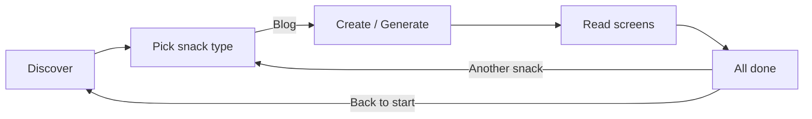

# Snack Blog flow map

Plain-English map of every floor a parent and kid walk through when making and reading **Blog snacks** in Effortless (Cognitive Mirror).

> **Snack** = one idea broken into tiny screens a kid can read in under a minute each.  
> **Blog snack** = the first snack type — short readable chunks, not a wall of text.

---

## Floors at a glance

| # | Floor (UI label) | Who | What happens |
|---|------------------|-----|--------------|
| 1 | **Discover** | Parent + kid | Learn what snack blogs are and why they help curiosity grow |
| 2 | **Pick a snack** | Parent + kid | Choose **Blog** as the snack type (more types later) |
| 3 | **Create your snack** | Parent (kid watches) | Enter a topic or pick a sample; optional local AI generates screens |
| 4 | **Read together** | Kid (parent nearby) | Swipe one idea per screen; progress chip shows spot in the story |
| 5 | **All done!** | Parent + kid | Celebrate, optional reflection, start another snack |

Progress chips in the prototype always show: `Discover · Pick · Create · Read · Done`.

---

## Floor 1 — Discover

**Plain English:** “We make tiny reading snacks — not long homework.”

- Welcome copy explains Effortless as a calm mirror for growing minds
- One illustration or emoji anchor (🌱)
- **Next:** “Let’s pick a snack type”

**Exit criteria:** User taps Continue and lands on Pick.

---

## Floor 2 — Pick a snack type

**Plain English:** “What kind of snack do we want today?”

- Cards for snack types; only **Blog** is enabled in v1
- Blog card subtitle: “Short story bites — one idea per screen”
- Future types (Story, Quiz, Picture) shown as “Coming soon” — not clickable

**Exit criteria:** User selects Blog → Create floor.

---

## Floor 3 — Create your snack

**Plain English:** “What should this blog snack be about?”

Two paths:

| Path | Steps |
|------|--------|
| **Try a sample** | Loads pre-built curiosity snack (`sample-curiosity.json`) |
| **Your topic** | Parent types topic (e.g. “Why do stars twinkle?”) → Generate (local Ollama) or use offline fallback text |

Rules enforced at generation time (see `web/snack-blog/DESIGN.md`):

- ≤80 words per screen
- One idea per screen
- Kid-safe, calm tone

**Exit criteria:** At least one screen exists → Read floor.

---

## Floor 4 — Read together

**Plain English:** “Read this screen. Tap Next when ready.”

- Large type, short paragraph per screen
- Screen counter: “3 of 7”
- Progress chip highlights **Read**
- Optional “Read aloud” hint for parent (no TTS required in v1)

**Exit criteria:** Last screen → Done floor.

---

## Floor 5 — All done!

**Plain English:** “You finished this snack!”

- Short celebration (no gamified loot boxes)
- Reflection prompt: “What was one new thing you learned?”
- Actions: **Another snack** (→ Pick) or **Back to start** (→ Discover)

---

## System diagram

---

## Prototype entry

| What | Where |
|------|--------|
| Open in browser | `web/snack-blog/index.html` |
| Local server (optional) | `npx --yes serve web/snack-blog -p 5173` → http://localhost:5173 |
| Design + snack rules | [web/snack-blog/DESIGN.md](../web/snack-blog/DESIGN.md) |
| Local LLM generation | [docs/local-llm-blog-snack.md](./local-llm-blog-snack.md) |

---

## Out of scope (this slice)

- WhatsApp delivery jobs
- Accounts, analytics, or in-app purchases
- Non-English locales
