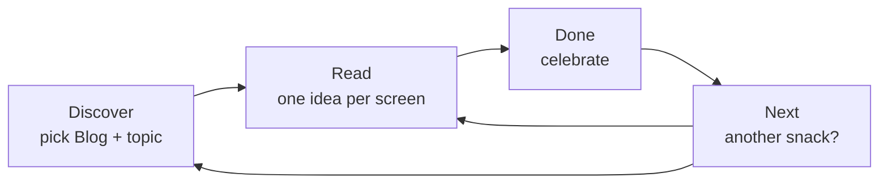

# FLOW-MAP — Blog snack (kid reader)

**Tree of truth** for the Effortless Blog snack prototype.  
Prototype: `web/snack-blog/index.html`

---

## Locks (v1)

| Lock | Value |
|------|--------|
| First snack title | **Why rain smells good** |
| Primary reader | **Ayaan**, ~10 / 4th grade |
| Out of scope | 3yo audience |
| Language | English |
| Layout | Mobile-first |
| Palette | Cream + ink |
| Macro flow | **Discover → Read → Done → Next** |
| Forbidden | Login, buy/cart, tracking UI |

---

## Macro floors (progress chips)

Chips always show four labels:

`Discover · Read · Done · Next`

| Chip | Plain English | Who |
|------|---------------|-----|
| **Discover** | “Let’s choose a blog snack and get it ready.” | Parent + Ayaan |
| **Read** | “One idea per screen — read at your pace.” | Ayaan (parent nearby) |
| **Done** | “You finished this snack!” | Both |
| **Next** | “Want another snack?” | Both → loops to Discover |

Pick snack type + enter topic happen **inside Discover** (no extra chips).

---

## Floor 1 — Discover

**Parent/kid hear:** “We make tiny reading snacks — not a wall of text.”

On one calm screen:

1. Greeting for **Ayaan** (4th grade reader)
2. **Blog** snack type (only type enabled in v1)
3. Topic field — default **Why rain smells good**
4. Actions:
   - **Read this snack** → loads bundled JSON → Read
   - **Generate new topic** → local Ollama or offline fallback → Read

**Exit:** Snack JSON loaded → chip moves to **Read**.

---

## Floor 2 — Read

**Parent/kid hear:** “Read this screen. Tap Next when ready.”

- Large ink type on cream background
- ≤80 words per screen, one idea each
- Counter: “Screen 3 of 6”
- Swipe or Previous / Next buttons
- Chip: **Read**

**Exit:** Last screen → **Done**.

---

## Floor 3 — Done

**Parent/kid hear:** “You finished this snack!”

- Celebrate without loot boxes or streak pressure
- Reflection: “What was one new thing you learned?”
- Primary: **Next snack** → **Next** floor

**Exit:** Tap Next snack.

---

## Floor 4 — Next

**Parent/kid hear:** “Ready for another bite?”

- Short prompt to pick a new topic or re-read rain snack
- **Start fresh** → Discover (cleared topic optional)
- **Read rain snack again** → Read

**Exit:** Loop to Discover or Read.

---

## Diagram



---

## Sample content

| File | Title |
|------|--------|
| `content/why-rain-smells-good.json` | Why rain smells good (default) |

---

## Open prototype

```bash
npx --yes serve web/snack-blog -p 5173
# → http://localhost:5173
```

Design + Stitch prompts: [DESIGN.md](./DESIGN.md)

Local LLM: [docs/local-llm-blog-snack.md](../../docs/local-llm-blog-snack.md)

---

## Out of scope

- WhatsApp jobs, accounts, commerce, toddler (3yo) copy
- Non-English UI in v1
